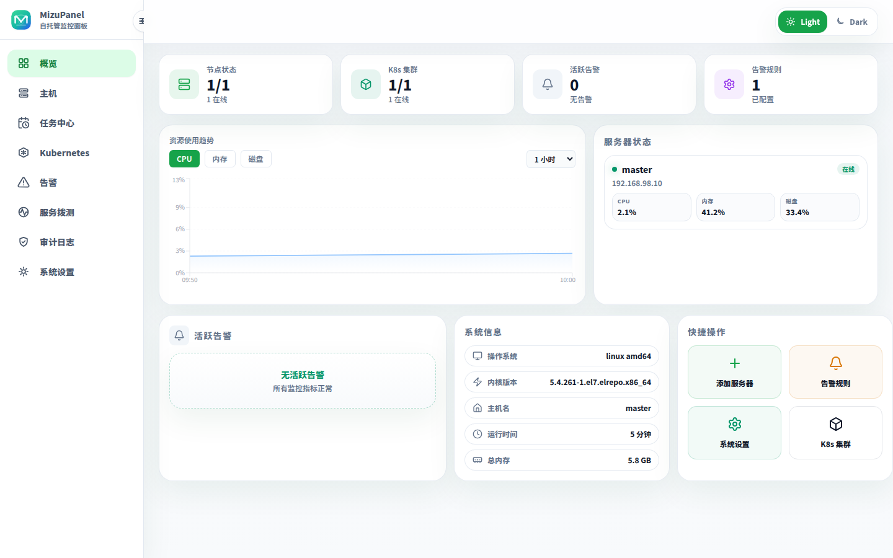
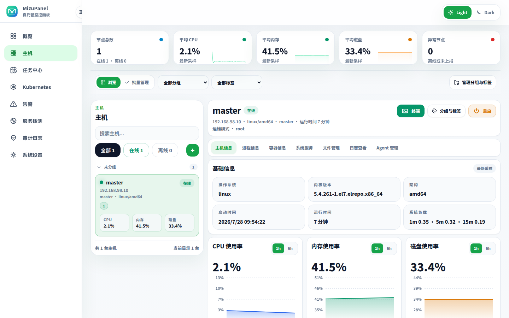
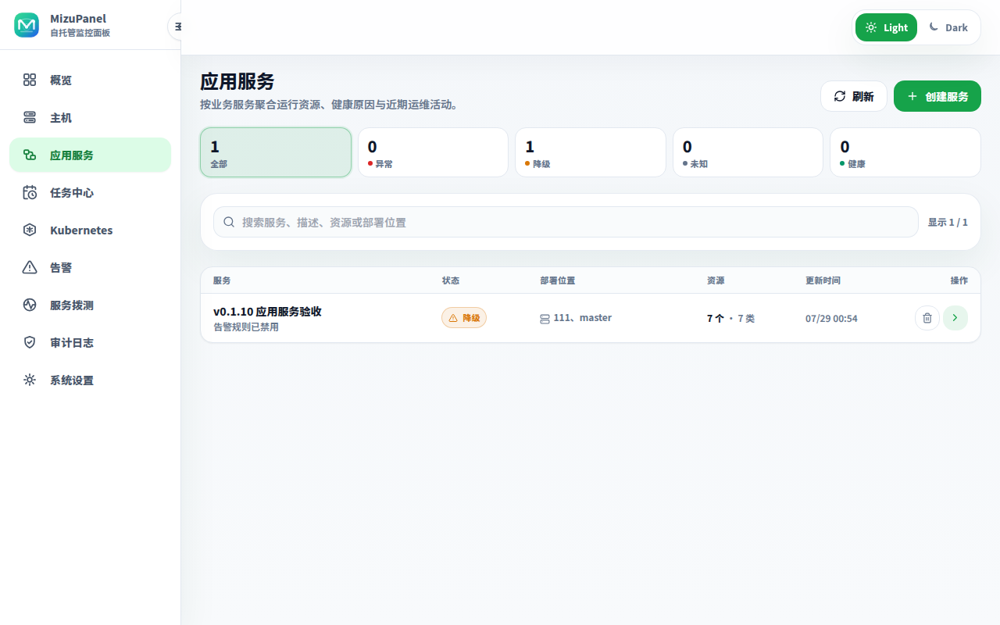
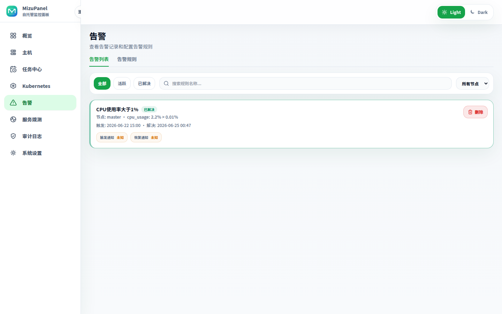
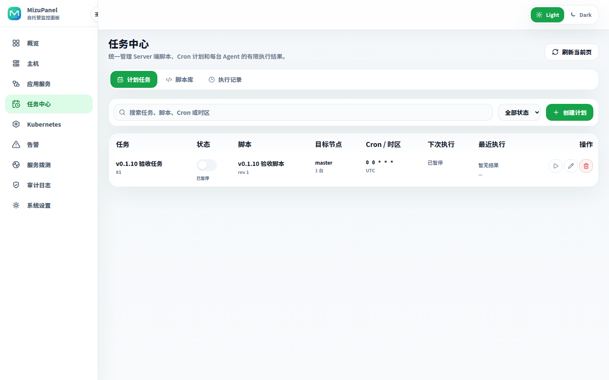
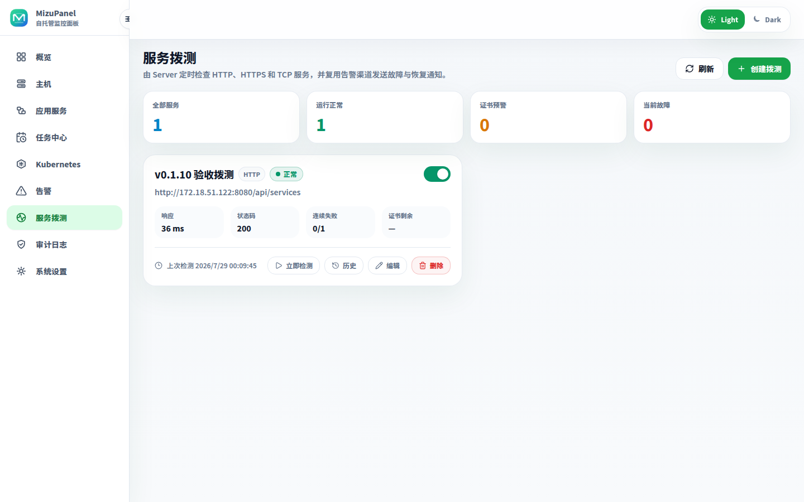
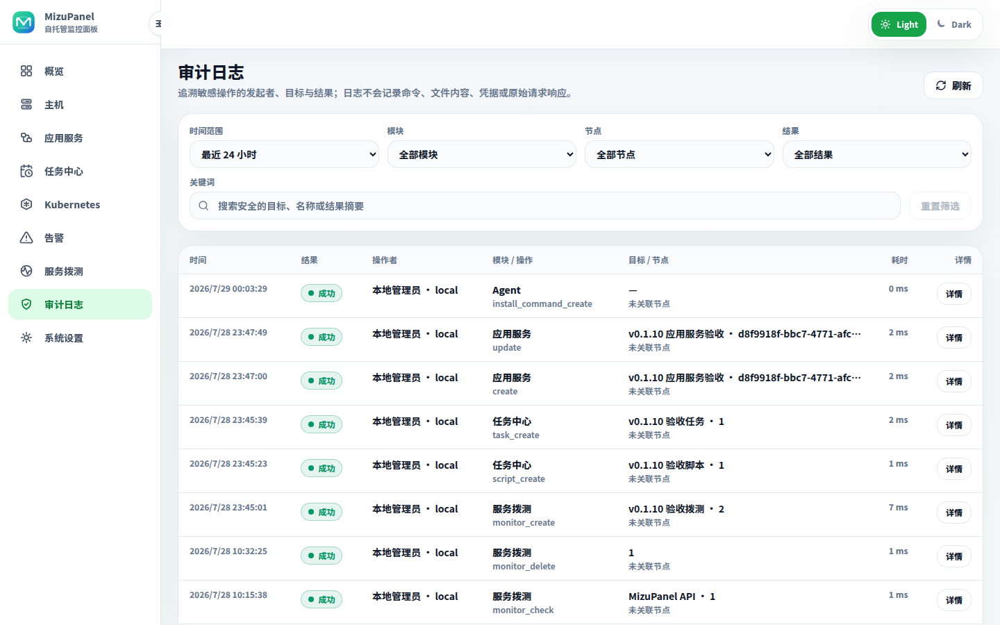

<p align="center">
  
</p>

<h1 align="center">MizuPanel</h1>

<p align="center">
  轻量级自托管运维面板，用一个干净的控制台管理应用服务、主机、Docker、Systemd、自动化任务、告警、服务拨测、操作审计和 Kubernetes 资源。
</p>

<p align="center">
  中文 · <a href="README.en.md">English</a>
</p>

<p align="center">
  <a href="https://go.dev/"></a>
  <a href="https://react.dev/"></a>
  <a href="https://vite.dev/"></a>
  <a href="https://www.sqlite.org/"></a>
  <a href="https://www.docker.com/"></a>
  
</p>

<p align="center">
  <a href="assets/screenshots/dashboard.png">
    
  </a>
</p>

<p align="center">
  Server + Dashboard + Agent 架构。Agent 主动连接 Server，上报指标并承载允许的运维操作；Server 可主动拨测其网络可达的服务，适合个人服务器、家庭实验室、小型主机集群和轻量 Kubernetes 管理。
</p>

<table>
  <tr>
    <td width="33%">
      <a href="assets/screenshots/host-detail.png"></a>
    </td>
    <td width="33%">
      <a href="assets/screenshots/services.png"></a>
    </td>
    <td width="33%">
      <a href="assets/screenshots/alerts.png"></a>
    </td>
  </tr>
  <tr>
    <td width="33%">
      <a href="assets/screenshots/tasks.png"></a>
    </td>
    <td width="33%">
      <a href="assets/screenshots/uptime.png"></a>
    </td>
    <td width="33%">
      <a href="assets/screenshots/audit.png"></a>
    </td>
  </tr>
</table>

<p align="center"><strong>功能介绍</strong></p>

<table>
  <tr>
    <td width="33%"><strong>主机监控</strong><br /><sub>节点状态、CPU、内存、磁盘、网络、负载和历史趋势。</sub></td>
    <td width="33%"><strong>主机与集群管理</strong><br /><sub>分组、标签、搜索筛选、单机编辑和多主机批量管理。</sub></td>
    <td width="33%"><strong>Agent 生命周期</strong><br /><sub>安装、连接诊断、日志、重启、身份持久化和安全升级到最新版。</sub></td>
  </tr>
  <tr>
    <td width="33%"><strong>Docker 工作区</strong><br /><sub>容器、受控 Compose 应用部署/更新/回滚/归档、镜像、数据卷、网络、日志和终端。</sub></td>
    <td width="33%"><strong>主机运维</strong><br /><sub>进程、Systemd 服务、文件管理、Web 终端和受控重启。</sub></td>
    <td width="33%"><strong>告警与通知</strong><br /><sub>指标规则、触发与恢复通知、Webhook、钉钉、飞书、重试和历史状态。</sub></td>
  </tr>
  <tr>
    <td width="33%"><strong>Kubernetes 管理</strong><br /><sub>集群接入、资源概览、Namespace、Node、Pod、Workload、Service、Ingress。</sub></td>
    <td width="33%"><strong>K8s 诊断</strong><br /><sub>Pod 日志、Events、Describe、YAML 查看与编辑、资源操作。</sub></td>
    <td width="33%"><strong>资源创建</strong><br /><sub>Deployment、Pod、Service、Ingress、ConfigMap、Secret、PVC、Job、CronJob。</sub></td>
  </tr>
  <tr>
    <td colspan="3"><strong>应用服务中心</strong><br /><sub>把节点、Compose、Systemd、Kubernetes 工作负载、服务拨测、告警规则和计划任务聚合成业务服务，统一查看健康原因、部署位置与近期活动。</sub></td>
  </tr>
  <tr>
    <td colspan="3"><strong>计划任务与脚本库</strong><br /><sub>集中保存 Shell 脚本，按标准五段 Cron 和独立时区在一个或多个 Agent 上执行，并查看每个节点的状态、耗时与有限输出。</sub></td>
  </tr>
  <tr>
    <td colspan="3"><strong>服务拨测</strong><br /><sub>由 Server 定时或手动发起 HTTP、HTTPS、TCP 检测，展示状态与延迟，预警 TLS 证书到期，并通过现有渠道发送故障与恢复通知。</sub></td>
  </tr>
  <tr>
    <td colspan="3"><strong>操作审计</strong><br /><sub>记录敏感操作的时间、结果、发起者类型、目标和节点，并在审计日志页面提供筛选、增量分页与安全详情；不会记录请求正文、机密内容或终端命令与输出。</sub></td>
  </tr>
</table>

<strong>应用服务中心</strong>

Dashboard 顶层的 **应用服务**（`/services`）是现有资源之上的逻辑运维视图。一个服务可以关联节点、Compose 项目、Systemd 服务、Kubernetes Deployment/StatefulSet/DaemonSet、服务拨测、告警规则和计划任务，并按异常、降级、健康、未知四种状态实时聚合可读原因、部署位置和近期活动。

应用服务不会复制或接管原资源。详情页只提供到现有管理入口的深链；删除应用服务只删除逻辑服务和关联记录，不会停止、修改或删除任何原资源。远端 Agent 或 Kubernetes 查询失败时，其余资源仍会返回，失败范围显示为暂不可用。

<strong>计划任务与脚本库</strong>

Dashboard 顶层的 **任务中心**（`/tasks`）提供计划任务、脚本库和执行记录三个视图。脚本可在最多 100 个目标节点上手动批量执行；计划任务使用标准五段 Cron 和独立 IANA 时区，可启用、暂停或立即触发，并按“不通知 / 失败时 / 始终”复用 Webhook、钉钉和飞书渠道。

调度由 Server 持久化管理，不会读取或修改宿主机已有的 `crontab`。Server 停止期间错过的多个周期在恢复后最多合并补跑一次，同一计划上一次仍未完成时会留下明确的 `skipped` 记录。Agent 使用固定 `/bin/sh <临时脚本>` 执行，脚本上限 128 KiB，单节点合并输出上限 64 KiB，默认超时 300 秒、最大 1800 秒；离线节点和不支持该能力的旧 Agent 会分别记录。

执行历史默认保留 30 天，每小时清理一次：

```yaml
tasks:
  retention: "30d"
  cleanup_interval: "1h"
```

Docker 部署可使用 `MIZUPANEL_TASK_RETENTION` 和 `MIZUPANEL_TASK_CLEANUP_INTERVAL` 覆盖这两个值。脚本内容、执行输出和通知凭据不会写入审计事件；完整配置和 API 边界见 [配置部署文档](docs/configuration.md)。

<strong>操作审计</strong>

Dashboard 顶层的 **审计日志**（`/audit`）沿用现有管理员认证配置，提供时间、模块、节点、结果和关键词筛选。供 Dashboard 使用的只读接口是 `GET /api/audit/events`；它支持游标分页以及时间、发起者、模块、操作、节点、结果和安全目标/摘要关键词过滤。

默认保留 90 天，每小时清理一次过期记录：

```yaml
audit:
  retention: "90d"
  cleanup_interval: "1h"
```

Docker 部署可使用 `MIZUPANEL_AUDIT_RETENTION` 和 `MIZUPANEL_AUDIT_CLEANUP_INTERVAL` 覆盖这两个值。审计写入是操作完成后的尽力记录，不会把写入失败变成原操作失败。它是运维证据，不是合规级不可变账本，也不提供多用户/RBAC 归属、导出或终端命令捕获。完整配置、API 参数和数据边界见 [配置部署文档](docs/configuration.md)。

<strong>Release 包部署运行</strong>

优先使用 GitHub Release 里的预构建包。按 Server 所在机器架构下载：

```bash
# x86_64 / amd64
curl -LO https://github.com/LeoKon3/MizuPanel/releases/latest/download/mizupanel-linux-amd64.tar.gz

# ARM64 / aarch64
curl -LO https://github.com/LeoKon3/MizuPanel/releases/latest/download/mizupanel-linux-arm64.tar.gz
```

如果你从源码本地构建，也可以执行：

```bash
# x86_64 / amd64
make package-linux-amd64

# ARM64 / aarch64
make package-linux-arm64
```

解压发布包并准备本机配置：

```bash
tar -xzf mizupanel-linux-amd64.tar.gz
cd mizupanel-linux-amd64
cp server.example.yaml server.yaml
```

如果 Agent 会从其他机器访问面板，建议先在 `server.yaml` 里设置面板地址：

```yaml
server:
  listen: ":8080"
  public_url: "http://你的服务器IP:8080"
```

启动 Server：

```bash
./mizupanel-server -config server.yaml
```

无需读取配置即可查看 Server 或已安装 Agent 的版本：

```bash
./mizupanel-server version
/usr/local/mizupanel/bin/mizupanel-agent version
```

`--version` 和 `-v` 也支持相同输出。

打开 `http://你的服务器IP:8080`，进入 Dashboard 后点击 **添加服务器**，复制 Linux 或 Windows Agent 安装命令到目标主机执行。

发布包内已经包含 Web 静态资源、安装脚本和 Agent 下载文件。Docker、MySQL、管理员认证、systemd 托管和 Token 模型等细节请看 [配置部署文档](docs/configuration.md)，更多界面可以查看 [完整截图](docs/screenshots.md)。

<sub>特别感谢 <a href="https://linux.do/">Linux.do</a> 社区的反馈、讨论和启发。</sub>
