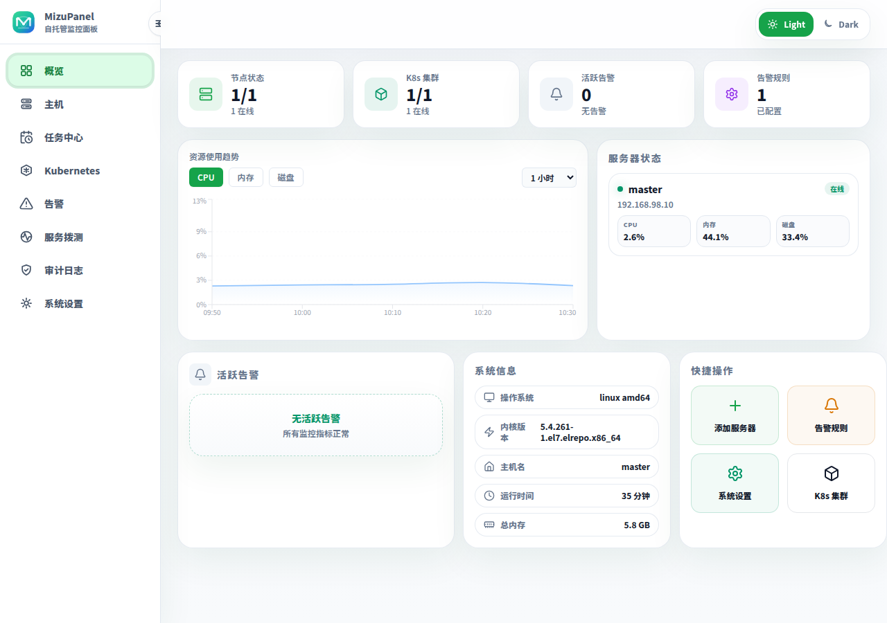
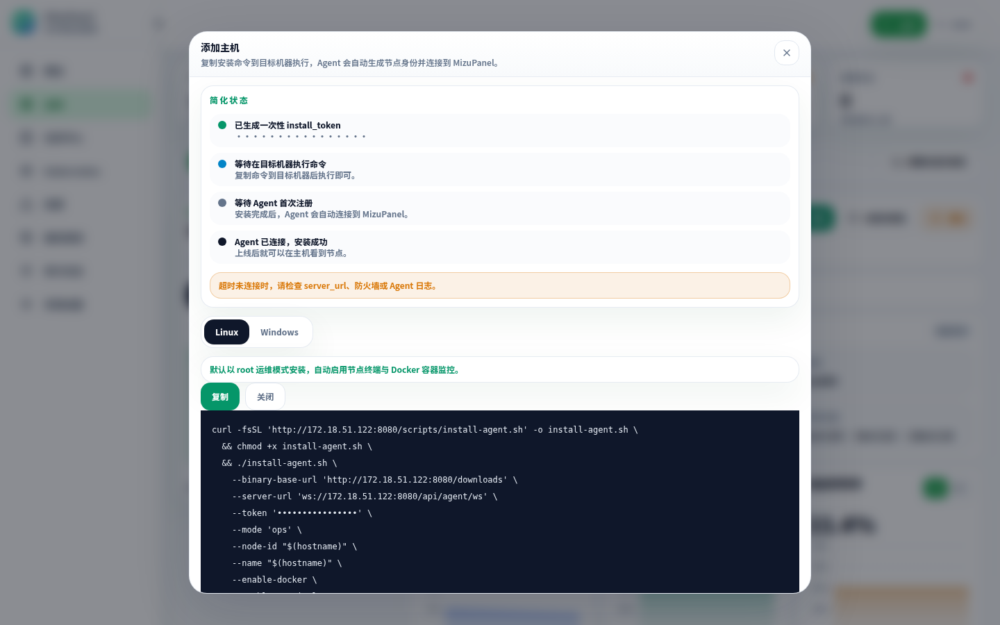
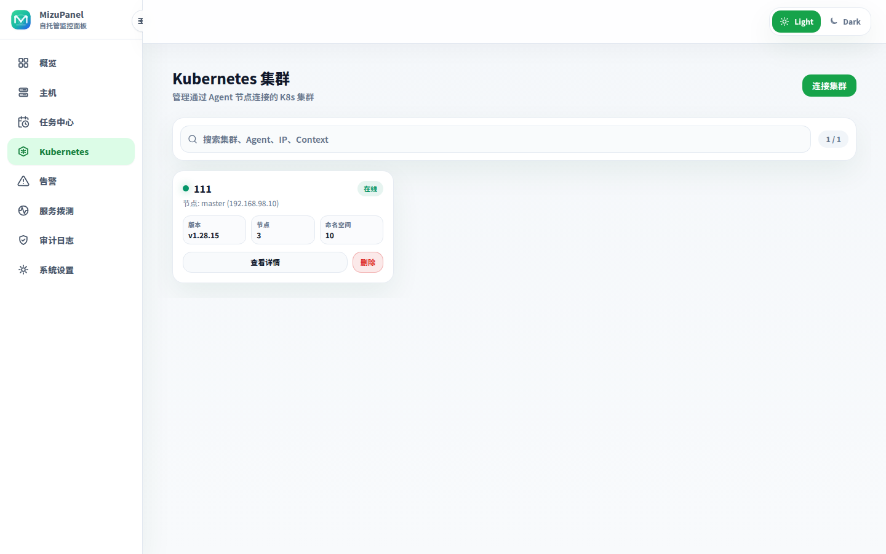
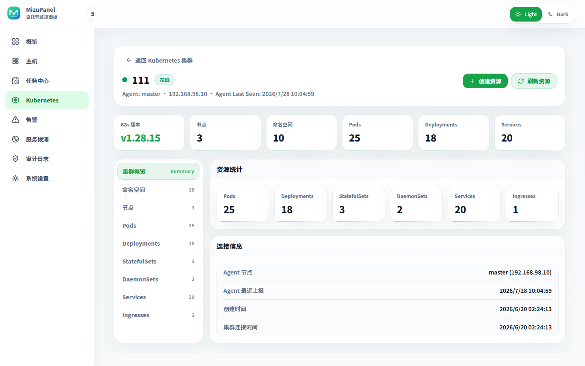
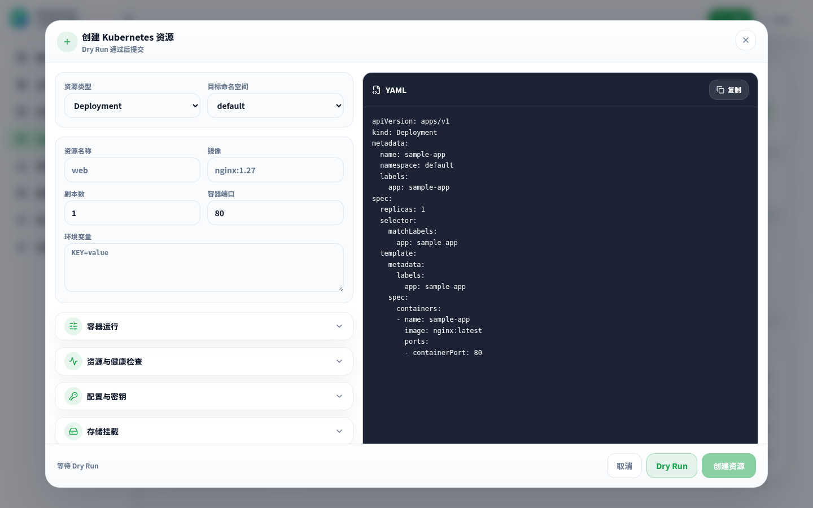
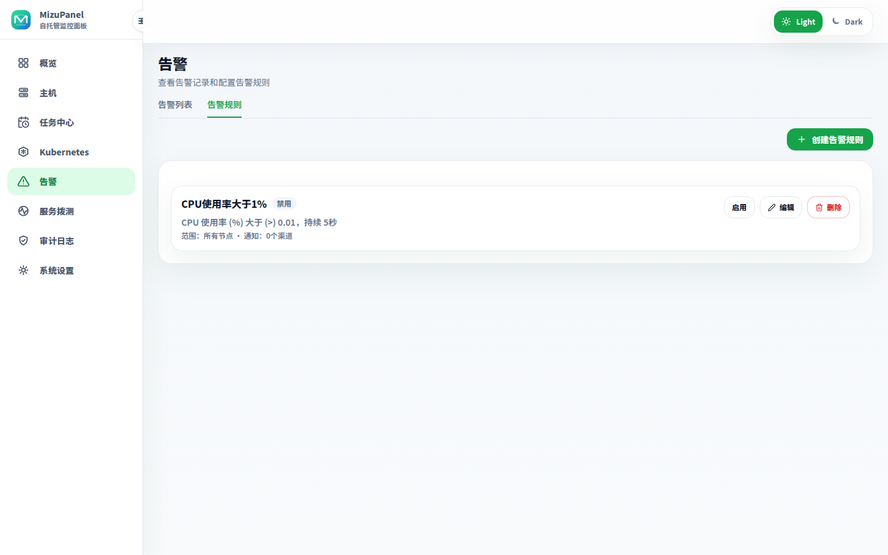

# Screenshots

[Back to README](../README.en.md) · [中文](screenshots.md)

These screenshots reflect the current interface. The README keeps only a compact preview; this page contains the fuller gallery.

## Overview

<table>
  <tr>
    <td width="50%">
      
       Overview at a 1440px desktop viewport.
    </td>
    <td width="50%">
      
       Overview at a 1280px desktop viewport.
    </td>
  </tr>
</table>

The overview shows node status, Kubernetes cluster status, active alerts, resource trends, server status, and quick actions.

## Hosts And Agents

<table>
  <tr>
    <td width="50%">
      
       Host detail, metric charts, Docker workspace, systemd, processes, files, and Agent management.
    </td>
    <td width="50%">
      
       Add hosts with Linux or Windows install commands; Agents keep persistent identities and support diagnostics and secure upgrades.
    </td>
  </tr>
</table>

## Task Center

  

The Task Center brings scheduled tasks, the script library, and run history together, with bounded Shell automation across one or more Agents.

## Kubernetes

<table>
  <tr>
    <td width="50%">
      
       Kubernetes cluster access and search.
    </td>
    <td width="50%">
      
       Cluster detail, resource summary, Namespace, Node, Pod, Workload, Service, and Ingress views.
    </td>
  </tr>
  <tr>
    <td colspan="2">
      
       Create resources with YAML preview, Dry Run, and forms for multiple resource kinds.
    </td>
  </tr>
</table>

## Alerts

<table>
  <tr>
    <td width="50%">
      
       Alert rules, active alerts, and alert history.
    </td>
    <td width="50%">
      
       Alert rule list and rule management.
    </td>
  </tr>
</table>

## Uptime Monitoring

  

The Server runs scheduled or manual HTTP, HTTPS, and TCP checks and presents status, latency, incidents, and certificate-expiry warnings.

## Audit Trail

  

The Audit Trail traces sensitive operations by time, module, node, and result while excluding commands, file contents, credentials, and other secret material.
