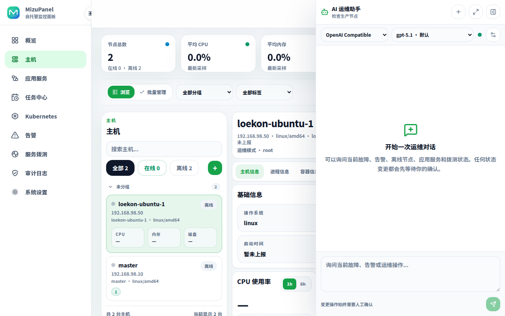
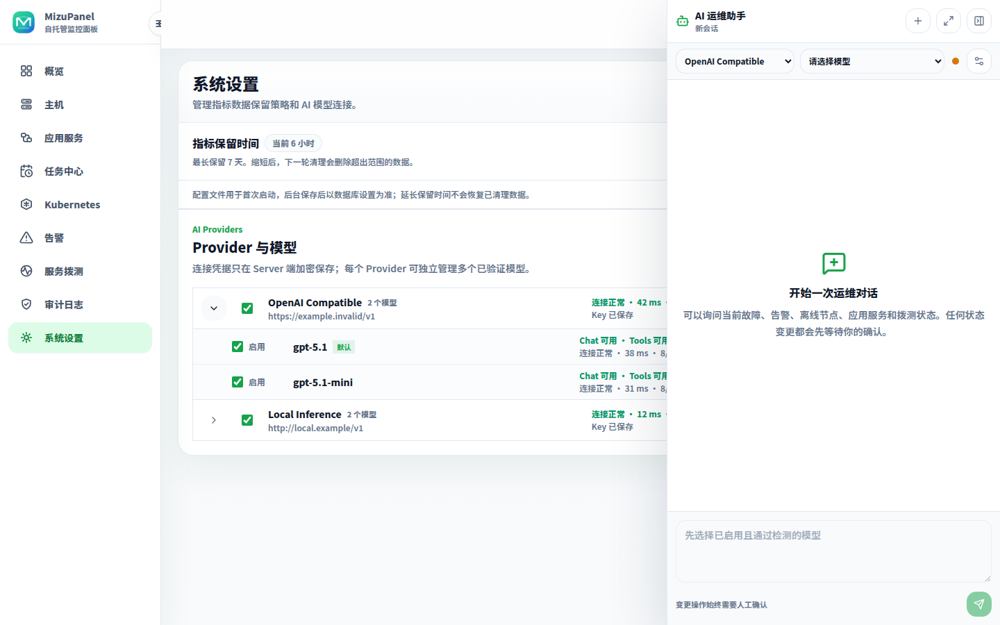

# 界面截图

[返回 README](../README.md) · [English](screenshots.en.md)

以下截图来自当前版本界面。README 首页只展示少量入口图，这里放完整截图集合。

## 概览

<table>
  <tr>
    <td width="50%">
      
       1440px 桌面视口下的概览页面。
    </td>
    <td width="50%">
      
       1280px 桌面视口下的概览页面。
    </td>
  </tr>
</table>

概览页展示节点状态、Kubernetes 集群状态、活跃告警、资源趋势、服务器状态和快捷操作。

## 应用服务中心

  

应用服务中心把七类现有运维资源聚合为逻辑业务服务，统一展示健康、原因、部署位置、资源规模与近期活动，同时保留到原管理入口的深链。

## 主机与 Agent

<table>
  <tr>
    <td width="50%">
      
       主机详情、指标曲线、Docker 工作区、Systemd、进程、文件与 Agent 管理。
    </td>
    <td width="50%">
      
       添加服务器，复制 Linux 或 Windows Agent 安装命令；Agent 会持久化身份并支持连接诊断与安全升级。
    </td>
  </tr>
</table>

## 任务中心

  

任务中心统一管理计划任务、脚本库和执行记录，支持在一个或多个 Agent 上执行受限 Shell 自动化。

## Kubernetes

<table>
  <tr>
    <td width="50%">
      
       Kubernetes 集群接入和搜索。
    </td>
    <td width="50%">
      
       集群详情、资源统计、Namespace、Node、Pod、Workload、Service 和 Ingress。
    </td>
  </tr>
  <tr>
    <td colspan="2">
      
       创建资源，支持 YAML 预览、Dry Run 和多类资源表单。
    </td>
  </tr>
</table>

## 告警

<table>
  <tr>
    <td width="50%">
      
       告警规则、活跃告警和历史告警。
    </td>
    <td width="50%">
      
       告警规则列表和规则管理。
    </td>
  </tr>
</table>

## 服务拨测

  

服务拨测由 Server 定时或手动检查 HTTP、HTTPS 和 TCP 目标，展示状态、延迟、故障与证书预警。

## 操作审计

  

审计日志按时间、模块、节点和结果追溯敏感操作，同时避免记录命令、文件内容与凭据等机密信息。

## AI 自然语言运维

  

顶部栏的 AI 运维助手可打开覆盖式右侧抽屉，支持键盘调整宽度、按 Provider 分组切换会话模型和新建会话；查询自动执行，变更操作需人工确认。

  

系统设置中的 AI 模型配置支持一条 Provider 连接管理多个模型，并提供模型发现、按需导入、逐模型能力检测及默认/回退路由；API Key 加密保存且不回显。
